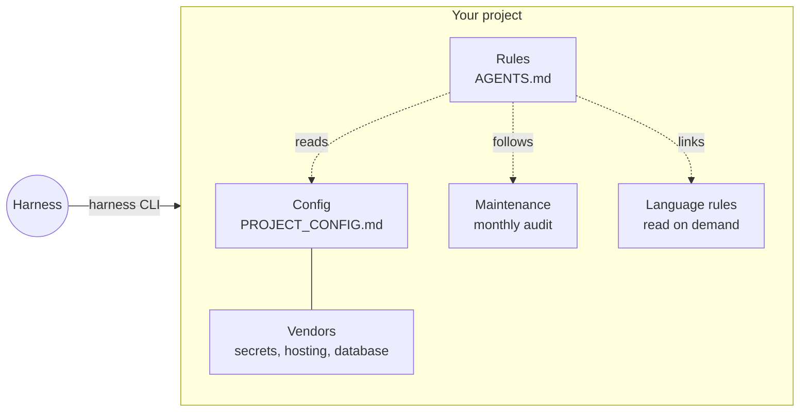
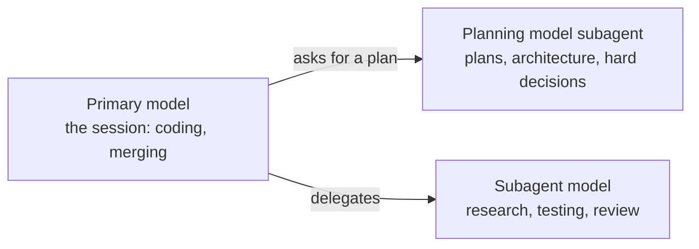

# harness

A small, project-agnostic rule set for AI coding agents (Claude Code, Codex, anything
that reads `AGENTS.md`), plus the `harness` CLI, which copies it into repos and keeps
them up to date without overwriting local edits.



## What's here

| Path | Purpose | Copied into projects? |
|---|---|---|
| [`template/AGENTS.md`](template/AGENTS.md) | The rules. Loaded in full every session. | yes |
| [`template/PROJECT_CONFIG.md`](template/PROJECT_CONFIG.md) | Per-project defaults; values marked "Set during setup" must be answered. | yes |
| [`template/docs/MAINTENANCE.md`](template/docs/MAINTENANCE.md) | The recurring maintenance audit. | yes |
| [`template/docs/languages/*.md`](template/docs/languages/) | Language-specific rules, read on demand. | yes |
| [`VERSION`](VERSION), [`CHANGELOG.md`](CHANGELOG.md) | Harness version (one integer, bumped per template change) and one line per version. | no |
| [`INSTALL.md`](INSTALL.md) | Steps an agent follows to install the harness into a repo. | no |
| [`harness`](harness) | CLI that installs and updates the template in a repo (`harness-sync` is an alias). | no |
| [`REVIEW.md`](REVIEW.md) | Brief for a model reviewing and lightening this harness, plus the review log. | no |
| [`EVAL.md`](EVAL.md) | Harness evaluation: fixed prompts and how to run them (issue #13). | no |
| [`eval/check.mjs`](eval/check.mjs) | Evaluator: fixed to-do checks and source counts for one run. | no |
| [`eval/run.sh`](eval/run.sh) | Runs one EVAL.md task in a fresh headless agent session, then checks it. | no |
| [`eval/fixture/`](eval/fixture/) | Baseline to-do app that the update task starts from. | no |
| [`eval/runs/`](eval/runs/) | Saved evaluation notes, checks, usage, diffs, and screenshots. | no |
| [`eval/results.jsonl`](eval/results.jsonl) | One evaluator record per stored run. | no |
| [`RATIONALE.md`](RATIONALE.md) | Why each rule exists. | no |
| [`AGENTS.md`](AGENTS.md), [`CLAUDE.md`](CLAUDE.md) | Rules for agents working on this repo itself. | no |
| [`.github/workflows/budget.yml`](.github/workflows/budget.yml) | CI word budget for `template/AGENTS.md`. | no |
| [`LICENSE`](LICENSE) | MIT. | no |

## Model tiers

Three tiers; each project names its models and effort in
[`PROJECT_CONFIG.md`](template/PROJECT_CONFIG.md). The session runs on the primary model and calls subagents on the other two.



## How agents load it (why it's split this way)

- **Always loaded:** in a project, `AGENTS.md` (and `CLAUDE.md`, which imports it with `@AGENTS.md`)
  goes into the context of every session in full. `@` imports and build steps that
  concatenate files don't save context; they only change how the rules are authored.
- **On demand:** a plain link costs nothing until the agent opens it. `AGENTS.md`
  points to `docs/languages/<language>.md` with an explicit trigger ("before editing
  code in a language"), so Python rules don't ride along in a TypeScript session.
- **Rule of thumb:** every-task rules go in `AGENTS.md`; rules that apply only when a
  trigger fires go in a linked file. Add your own language by dropping in
  `docs/languages/<language>.md`. The `harness` CLI leaves files it doesn't own alone.

## Adopt it

Tell your coding agent: **"Follow INSTALL.md in github.com/mattsilv/harness."**
The rest of this section is the manual version.

With the `harness` CLI (needs Python 3.9+ and git; `gh` for the optional checks):

```bash
git clone https://github.com/mattsilv/harness ~/gh/harness
ln -sf ~/gh/harness/harness ~/.local/bin/harness
cd your-repo && harness init   # never overwrites existing files
```

Without it: copy `template/` into your repo and add `@AGENTS.md` to `CLAUDE.md`.

```bash
harness init          # new or existing repo: write missing files, record baseline
harness check         # silent unless the harness changed, config is unset, conflicts remain, or maintenance is overdue
harness diff          # what the harness changed since this repo last applied it
harness apply [path]  # 3-way merge harness changes into local files, keeping local edits
```

- **Baseline:** `.harness/base/<path>` holds the harness text last applied. Commit it.
  `diff` compares harness to harness, so local additions never show as noise.
- **Approval:** nothing updates on its own. `check` prints a notice; the agent shows
  `diff`, summarizes, and runs `apply` after the operator says yes.
- **Unset values:** any `PROJECT_CONFIG.md` line still reading "Set during setup" is
  reported every session until answered.
- **Maintenance:** `check` reads the tracking issue named in `PROJECT_CONFIG.md` (via
  `gh`, cached 1h) and nags when the audit interval in `docs/MAINTENANCE.md` has passed.
- **CI gate:** with merge policy `auto`, `check` confirms the default branch requires
  status checks and warns to treat merges as `on-request` until it does.
- **Session start:** run `harness check` from a Claude Code `SessionStart` hook
  (e.g. `git rev-parse --git-dir >/dev/null 2>&1 && harness check || true`), or
  tell other agents to run it in their global `AGENTS.md`.
- **Fork:** set `HARNESS_SYNC_REPO` to your fork's clone URL.

## Change it

Open a PR against `template/`. Preview its effect on a project before merging:

```bash
cd your-repo && HARNESS_SYNC_SOURCE=/path/to/harness-branch/template harness diff
```

Every rule needs a line in `RATIONALE.md`. CI fails if `template/AGENTS.md` grows past
its word budget (`.github/workflows/budget.yml`); raising the budget is a deliberate
edit in the same PR.

When a new frontier model ships, or once a quarter, give a model this repo and ask it
to follow [REVIEW.md](REVIEW.md).

Everything here is public: no PII, hostnames, or project specifics.
